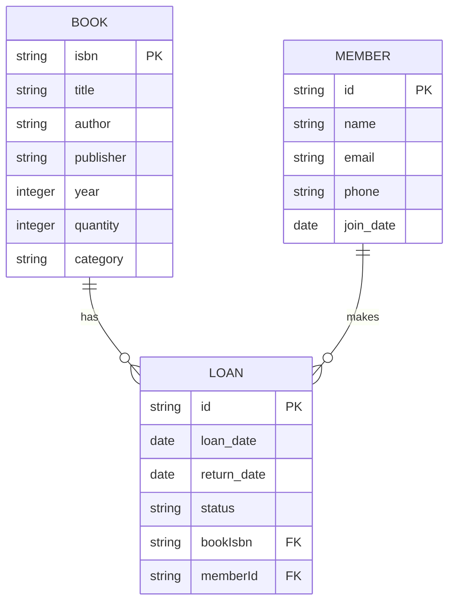

# 📚 Sistem Manajemen Perpustakaan Digital


**Sistem manajemen perpustakaan modern** dengan antarmuka futuristic dan fitur lengkap untuk mengelola koleksi buku, anggota, dan transaksi peminjaman.

## ✨ Fitur Utama

- **Dashboard Interaktif** dengan visualisasi data
- Manajemen katalog buku digital
- Sistem keanggotaan terintegrasi
- Pelacakan peminjaman & pengembalian
- Pencarian canggih dengan filter
- Laporan statistik otomatis

## 🚀 Teknologi


**Frontend:**
- Next.js 14 (App Router)
- Tailwind CSS + Glassmorphism UI
- Recharts untuk visualisasi data
- Animasi modern dengan Framer Motion

**Backend:**
- PostgreSQL database
- Prisma ORM
- API Routes (Next.js)
- Sistem autentikasi modern

## 🛠️ Instalasi

1. Clone repositori:
```bash
git clone https://github.com/username/library-management-system.git
cd library-management-system
```

2. Install dependencies:
```bash
npm install
```

3. Setup environment variables:
```bash
cp .env.example .env.local
```
Isi variabel database PostgreSQL Anda di `.env.local`

4. Jalankan migrasi database:
```bash
npx prisma migrate dev
```

5. Jalankan development server:
```bash
npm run dev
```

## 📊 Struktur Database



## 🌈 Kontribusi

Kami menyambut kontribusi! Ikuti langkah berikut:
1. Fork project
2. Buat branch fitur (`git checkout -b fitur/namafitur`)
3. Commit perubahan (`git commit -m 'Tambahkan fitur'`)
4. Push ke branch (`git push origin fitur/namafitur`)
5. Buat Pull Request

## 📜 Lisensi

Projek ini dilisensikan di bawah [MIT License](LICENSE).

---

<div align="center">
  
</div>
